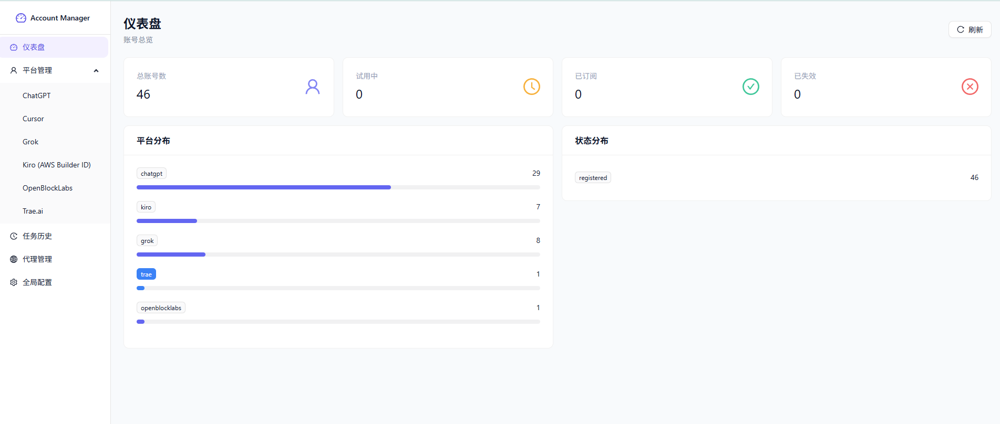
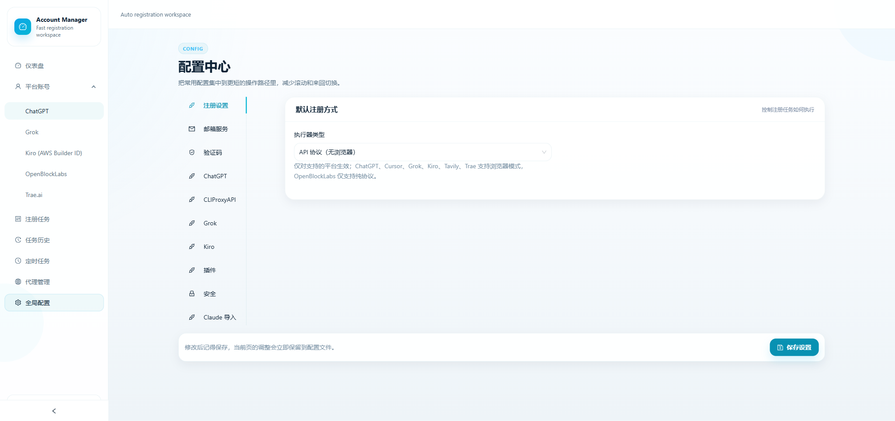

# Free Register Tool

A self-hosted account registration and operations workspace with a FastAPI backend, React frontend, plugin-based platform integrations, mailbox adapters, proxy management, scheduling, and external sync support.

This repository is intended for local deployment, controlled automation, development, and research workflows. Use it only in ways that comply with platform terms, local law, and your own risk controls.

## Preview

### Dashboard



### Settings Center



## What It Does

- Multi-platform account workflows through a plugin architecture under `platforms/`
- Web-based management UI for accounts, settings, logs, and scheduled tasks
- Batch registration tasks with progress tracking and resumable task state
- Mailbox provider abstraction for temporary mail and self-hosted mailbox flows
- Captcha and browser automation support for supported providers and platforms
- Proxy pool management and request routing controls
- ChatGPT-oriented token management, status probing, payment-link retrieval, and Sub2API sync
- Scheduled task execution for recurring registration workloads

## Recent UI Improvements

- Brighter, denser management UI with faster table interactions
- Responsive accounts page with cleaner toolbar and compact action layout
- Settings page flow summary for ChatGPT registration-related configuration
- History and scheduler pages with tighter action grouping and better filtering
- Reduced topbar clutter and cleaner right-side panel behavior

## Stack

- Backend: FastAPI, Uvicorn, SQLModel, APScheduler
- Frontend: React, TypeScript, Vite, Ant Design
- Automation: Playwright, Camoufox
- Networking: `curl_cffi`, `httpx`
- Storage: SQLite

## Repository Layout

```text
api/          HTTP API routes
core/         Shared runtime, registry, scheduler, database helpers
frontend/     React frontend
platforms/    Platform plugins and platform-specific logic
services/     Background services and integration helpers
scripts/      Project utility scripts
tests/        Automated tests
tools/        Operational helper tools
docker/       Container entrypoint assets
main.py       Backend entrypoint
```

## Quick Start

### 1. Clone

```bash
git clone https://github.com/0311119/Free_RegisterTool.git
cd Free_RegisterTool
```

### 2. Create a Python environment

```bash
python -m venv .venv
```

Windows PowerShell:

```powershell
.venv\Scripts\Activate.ps1
```

macOS / Linux:

```bash
source .venv/bin/activate
```

### 3. Install backend dependencies

```bash
pip install -r requirements.txt
```

### 4. Install browser automation dependencies

```bash
python -m playwright install chromium
python -m camoufox fetch
```

### 5. Install frontend dependencies

```bash
cd frontend
npm install
npm run build
cd ..
```

### 6. Create local config

```bash
cp .env.example .env
```

Then edit `.env` for your local environment and integrations.

### 7. Start the backend

```bash
python main.py
```

Default docs:

```text
http://localhost:8000/docs
```

## Frontend Development

```bash
cd frontend
npm install
npm run dev
```

Default dev URL:

```text
http://localhost:5173
```

## Key Screens

- `Dashboard`: status summary and platform distribution overview
- `Accounts`: account list, detail drawer, batch actions, status sync, upload actions
- `Register Task`: batch registration execution with live progress
- `Scheduled Tasks`: recurring registration jobs
- `Task History`: registration log inspection and cleanup
- `Settings`: provider, captcha, integration, and platform-specific configuration

## Configuration Notes

The project reads configuration from `.env` plus persisted runtime settings stored by the app.

Common categories:

- Server host and port
- Captcha solver settings
- Proxy settings
- Mailbox provider credentials
- External sync endpoints such as Sub2API
- Platform-specific runtime options

Start from [`.env.example`](./.env.example).

## Testing

```bash
pytest tests/
```

Some repository scripts are operator helpers rather than repeatable tests. Prefer the `tests/` suite for validation.

## Privacy And Safe Publishing

This repository is configured to keep local machine state, secrets, and personal runtime artifacts out of version control.

Ignored local-only content includes:

- `.env`
- `data/`
- `logs/`
- `runtime/`
- `static/`
- `*.db`, `*.sqlite`, `*.sqlite3`
- local tokens, Gmail OAuth files, temporary screenshots, and debug logs
- local helper scripts and machine-specific operational files

If you fork or publish your own copy, double-check that you are not committing:

- API keys
- mailbox credentials
- OAuth token exports
- backend logs
- screenshots containing private account data
- local path screenshots from integration pages

## Docker

Basic Docker workflow:

```bash
docker-compose up -d
docker-compose logs -f
docker-compose down
```

## Development Notes

- Add new platform logic under `platforms/`
- Shared abstractions live under `core/`
- API routes live under `api/`
- Frontend pages live under `frontend/src/pages/`
- UI primitives live under `frontend/src/components/` and `frontend/src/components/ui/`

## License

MIT. See [LICENSE](./LICENSE) and [NOTICE](./NOTICE).

## Acknowledgement

This repository builds on earlier upstream and forked work in the same ecosystem. See project history and notices in the repository for attribution details.
